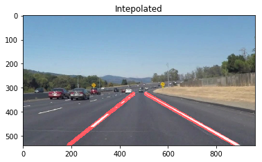
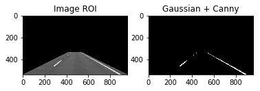
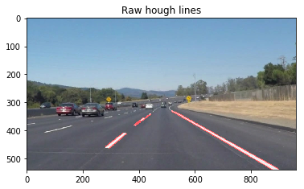

#**Finding Lane Lines on the Road**

In this project, we will find lane lines on image and video sequences. 

### 1. Pipeline

My pipeline consisted of 5 steps. 

1. I converted the images to grayscale

2. Applied region of interest mask. Here, I assumed car is moving roughly between two lane lines
3. Applied simple binary thresholding. Alternatively, otsu's thresholding method can be used in order to deal with illumination changes
4. Applied gaussian filtering and canny edge detection

5. Applied hough line extraction method

6. From many line segments, decided which segments belong to left and right lanes lines by checking the slope of line segments and absolute x coordinates of segments.
7. Fitted a line to left and right line segments to obtain smoother and more robust estimation.

### 2. Potential shortcomings of my pipeline

There are several shortcoming of our apporach. First, we assume that car is moving roughly on the center of the lane and it only sees one line on each side. If there are multiple lanes, our approach will draw lines between two lane lines. Second, illumination changes. We use simple color thresholding to distinguish lane lines from road surface. If road surface color is close to line color we treat them as lines. Using adaptive thresholding would solve this issue to some extend however adaptive thesholding may not handle shadows on the road. 

### 3. Possible improvements for my pipeline

We determined the threshold value manually and it may not perform well under different road illumination conditions. It should be used together with adaptive thresholding method. Moreover, different regions on the road can have different illumination due to shadows from building, trees, vehicles etc.. Using Otsu's thresholding method can help overcoming this issue.

Another big improvement idea in order to increase the robustness would be to use clustering methods to cluster line segments belonging to lines and segment out outliers. 

We can also use filtering to smooth out the detection.
